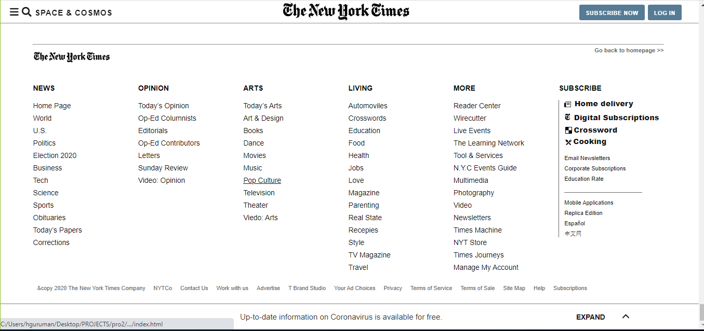

# Project Name

> This project is a clone of "New York Times Magazine" completed based on the requirement to complete Microverse program/course titled "HTML and CSS".

Additional description about the project and its features.

## Built With

- HTML
- CSS,

## Live Demo pending approval....

[Live Demo Link](https://livedemo.com)
[Github Repository Link](https://github.com/Rocio01/PositioningandFloatingElements/tree/feature-branch)

## Getting Started

**This is an example of how you may give instructions on setting up your project locally.**
**Modify this file to match your project, remove sections that don't apply. For example: delete the testing section if the currect project doesn't require testing.**

To get a local copy up and running follow these simple example steps.

### Prerequisites

- Browser (Google Chrome, Mozilla Firefox, Safari or any other browser)

### Setup

- Download or clone the repository's files
- Open the index.html file using any web browser of your choice

## Authors

👤 **Author1**

- Github: [@Rocio01](https://github.com/Rocio01)
- Twitter: [@rugiada8801](https://twitter.com/rugiada8801)
- Linkedin: [zulma-martinez-5247a31a8](https://www.linkedin.com/in/zulma-martinez-5247a31a8/)

👤 **Author2**

- Github: [@happiguru](https://github.com/happiguru)
- Twitter: [@Lekunze_Nle](https://twitter.com/Lekunze_Nley)
- Linkedin: [lekunze-nley](https://www.linkedin.com/in/lekunze-nley/)

## 🤝 Contributing

Contributions, issues and feature requests are welcome!

Feel free to check the [issues page](issues/).

## Show your support

Give a ⭐️ if you like this project!

## Acknowledgments

- Hat tip to anyone whose code was used
- Inspiration
- etc

## 📝 License

This project is [MIT](lic.url) licensed.
